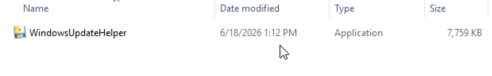
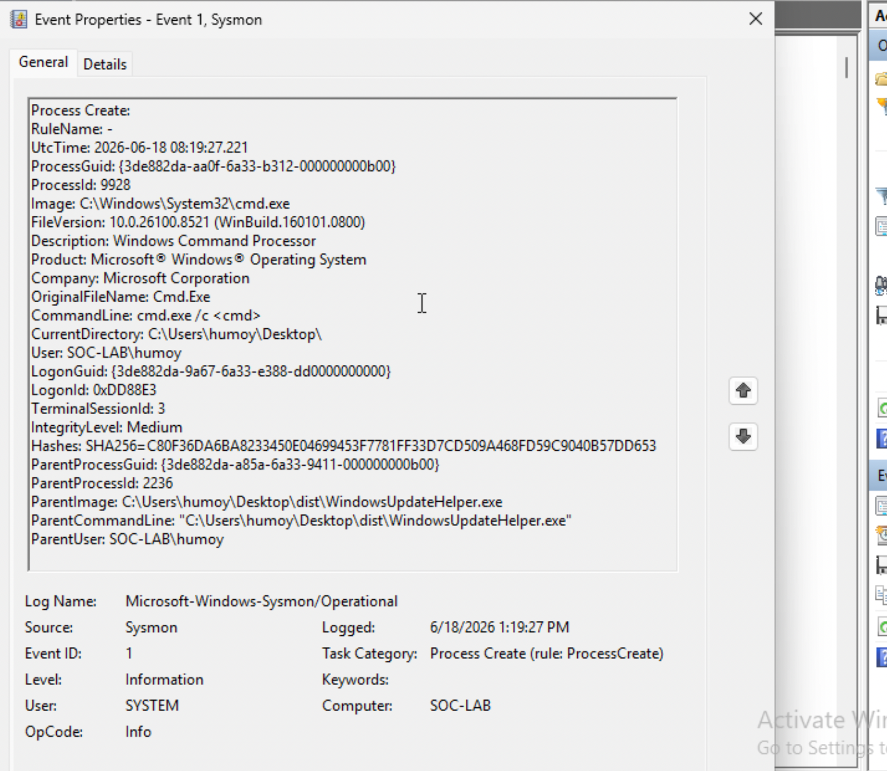
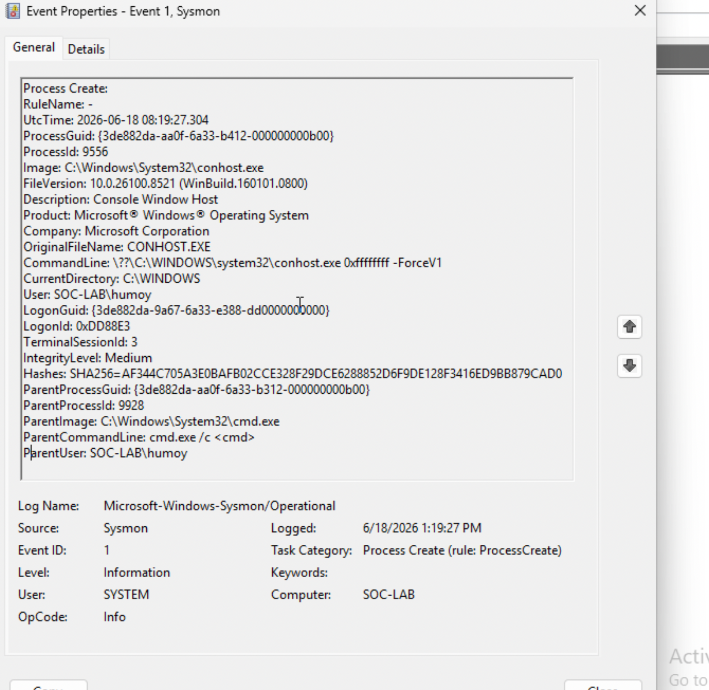
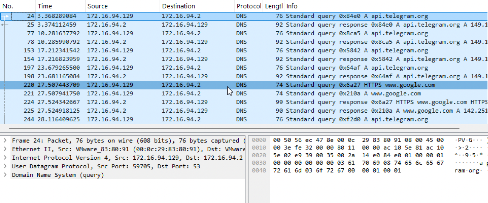
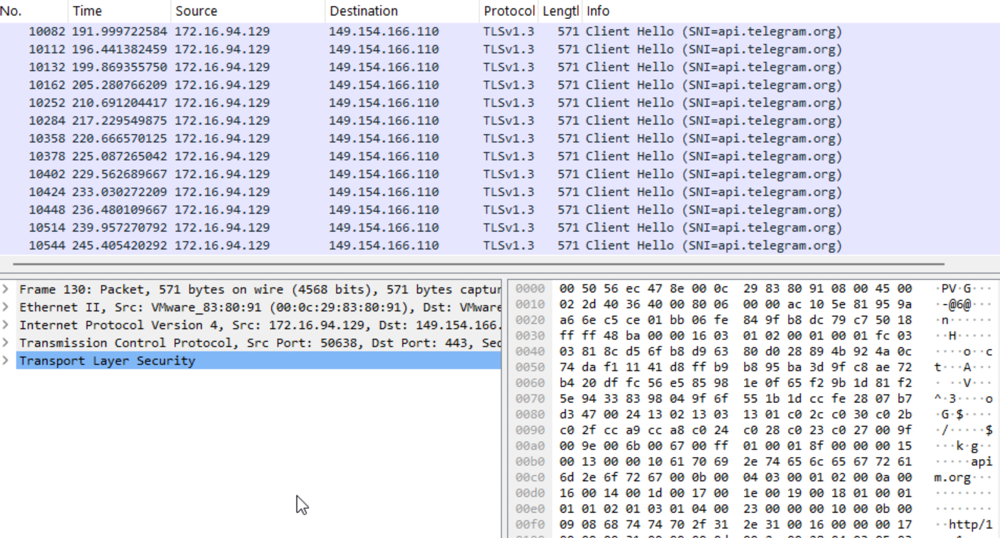
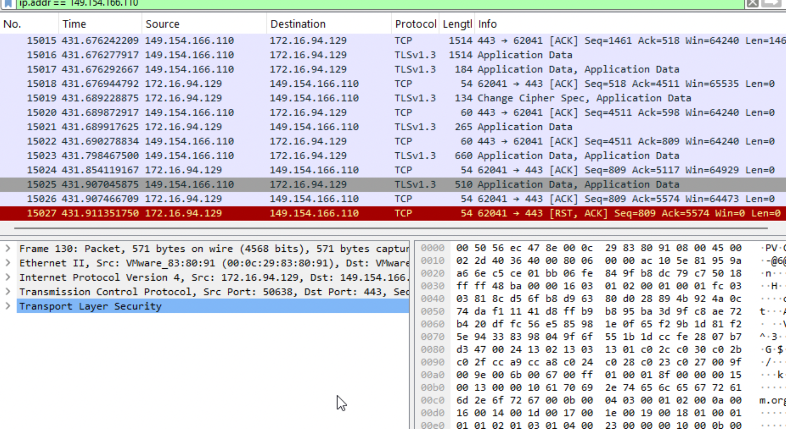
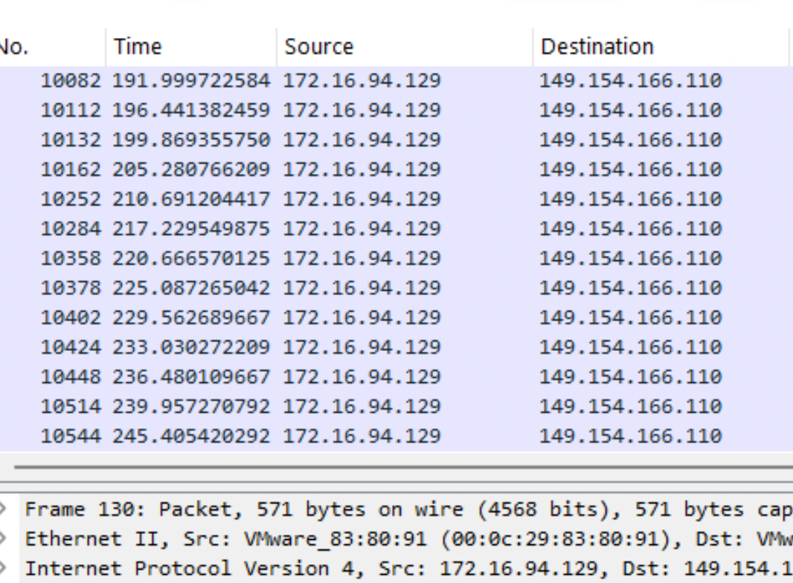

# Telegram RAT Investigation

## Overview

This project documents the investigation of a Telegram-based Remote Access Trojan (RAT) in a controlled SOC laboratory environment.

The objective was to identify malicious process execution, reconstruct the process tree, analyze network communications, extract Indicators of Compromise (IOCs), and map observed behavior to the MITRE ATT&CK framework.

---

# Investigation Objectives

* Analyze suspicious executable behavior
* Identify parent-child process relationships
* Detect command execution activity
* Investigate DNS and TLS communications
* Extract Indicators of Compromise (IOCs)
* Map techniques to MITRE ATT&CK
* Develop detection opportunities

---

# Lab Environment

| Component        | Description                |
| ---------------- | -------------------------- |
| OS               | Windows 11 Virtual Machine |
| Logging          | Sysmon                     |
| Network Analysis | Wireshark                  |
| Analysis Type    | Dynamic Analysis           |
| Sample           | WindowsUpdateHelper.exe    |

---

# Process Analysis

## Process Tree

```text
WindowsUpdateHelper.exe
└── cmd.exe /c <cmd>
    └── conhost.exe
```

## Findings

The executable spawned cmd.exe using the `/c` switch, indicating command execution capability.

A subsequent conhost.exe process was created, confirming console-based command execution.

---

## Evidence

### Malware Execution



**Figure 1 – Initial execution of WindowsUpdateHelper.exe.**

The suspicious executable was launched from the user's desktop and initiated the observed activity chain.

---

### Command Execution



**Figure 2 – WindowsUpdateHelper.exe spawning cmd.exe.**

Sysmon Event ID 1 revealed that the executable launched cmd.exe using the `/c` switch, demonstrating the ability to execute operating system commands.

---

### Console Host Creation



**Figure 3 – cmd.exe spawning conhost.exe.**

Creation of conhost.exe confirmed that command execution was performed through the Windows console subsystem.

---

# Network Analysis

## DNS Activity

Multiple DNS requests were observed for:

```text
api.telegram.org
```

### DNS Requests



**Figure 4 – DNS requests to Telegram infrastructure.**

The infected host repeatedly resolved api.telegram.org before establishing encrypted communications.

---

## TLS Analysis

TLSv1.3 Client Hello packets revealed:

```text
SNI = api.telegram.org
```

### TLS Client Hello



**Figure 5 – TLS Client Hello revealing Telegram destination.**

The Server Name Indication (SNI) field exposed the intended destination before encryption was established.

---

## TLS Application Data

Encrypted communications were observed between the infected host and Telegram infrastructure.

### Encrypted Communications



**Figure 6 – TLSv1.3 encrypted application data.**

The session exchanged encrypted application data over HTTPS, preventing payload inspection while confirming active communication.

---

## Beaconing Pattern

The host established recurring outbound TLS sessions to Telegram infrastructure.

### Periodic Communications



**Figure 7 – Repeated outbound communications.**

Regular outbound connections were observed at consistent intervals, indicating possible command-and-control polling behavior.

---

## External Infrastructure

### Domain

```text
api.telegram.org
```

### IP Address

```text
149.154.166.110
```

The infrastructure was contacted repeatedly throughout the execution of the sample.

---

# Indicators of Compromise (IOCs)

## Domains

```text
api.telegram.org
```

## IP Addresses

```text
149.154.166.110
```

## Processes

```text
WindowsUpdateHelper.exe
cmd.exe
conhost.exe
```

## Protocols

```text
HTTPS
TLSv1.3
```

---

# MITRE ATT&CK Mapping

| Technique ID | Technique                  |
| ------------ | -------------------------- |
| T1059.003    | Windows Command Shell      |
| T1071.001    | Application Layer Protocol |
| T1105        | Ingress Tool Transfer      |
| T1219        | Remote Access Software     |

---

# Detection Opportunities

## Sigma Rule Concept

Detect command shell execution spawned by unknown user-space applications.

### Detection Logic

```yaml
ParentImage: *WindowsUpdateHelper.exe
Image: *cmd.exe
```

---

## Elastic Security Queries

### Process Execution

```text
process.parent.name:"WindowsUpdateHelper.exe"
and process.name:"cmd.exe"
```

### Console Host

```text
process.parent.name:"cmd.exe"
and process.name:"conhost.exe"
```

### Telegram DNS

```text
dns.question.name:"api.telegram.org"
```

### Telegram TLS

```text
tls.server.name:"api.telegram.org"
```

### Telegram IP

```text
destination.ip:"149.154.166.110"
```

---

# Recommendations

## Immediate Actions

* Isolate affected host
* Preserve Sysmon logs
* Acquire memory image
* Collect malware sample

---

## Detection Improvements

* Enable Sysmon Event ID 1 collection
* Enable Sysmon Event ID 3 collection
* Correlate process creation with network telemetry
* Alert on Telegram API communications from non-approved applications

---

## Long-Term Improvements

* Deploy EDR
* Implement application allowlisting
* Conduct periodic threat hunting
* Establish threat hunting procedures for encrypted C2 channels

---

# Lessons Learned

* Parent-child process relationships are critical for malware investigations.
* DNS evidence alone is insufficient.
* TLS SNI provides valuable destination visibility.
* Correlating Sysmon and Wireshark significantly increases confidence.
* Telegram Bot API can be abused as a command-and-control channel.
* Network and endpoint telemetry should always be analyzed together.

---

# Final Assessment

## Verdict

**Confirmed Malicious Activity**

## Threat Type

**Telegram RAT**

## Severity

**High**

## Confidence

**High**

## Conclusion

The investigation confirmed command execution capability and encrypted communications with Telegram infrastructure.

The sample established outbound HTTPS connections to Telegram infrastructure, executed system commands through cmd.exe, and demonstrated behavior consistent with a Telegram-based Remote Access Trojan (RAT) using HTTPS polling as a command-and-control mechanism.

---

# Repository Structure

```text
Telegram-RAT-Investigation/

├── README.md
├── Telegram_RAT_Investigation_Full_Report.docx

├── screenshots/
│   ├── 01_sysmon_malware_execution.png
│   ├── 02_sysmon_cmd_spawn.png
│   ├── 03_sysmon_conhost_spawn.png
│   ├── 04_wireshark_dns_telegram.png
│   ├── 05_wireshark_tls_sni.png
│   ├── 06_wireshark_tls_application_data.png
│   └── 07_wireshark_beaconing.png

├── iocs/
│   └── iocs.txt

└── detections/
    ├── sigma_rule.yml
    └── elastic_query.txt
```
rypted communications with Telegram infrastructure. The observed behavior is consistent with a Telegram-based Remote Access Trojan using HTTPS polling for command-and-control communications.
